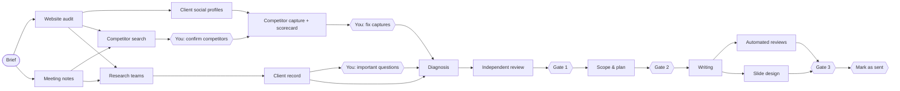

# Plan v2 — guided workflow, new Control Center, stronger proposal

Written 2026-09-15 after the ALUVI (مصنع مناحي الشريف) run. The owner asked for three core changes:

1. The steps are planned: what runs in parallel, what must finish first, and what needs a person.
2. The Control Center is rebuilt: clean, clearly named, and organised around those steps.
3. Skills and libraries that genuinely help are installed.

The owner is also open to changing the proposal itself, as long as the result is a professional technical proposal the client sees before paying.

The constitutional rules in `CLAUDE.md` do not change:
- Code decides services, deliverables, timing and numbers.
- Nothing reaches a client without approval.
- Evidence comes before any problem.
- No paid software.

---

## 0. What went wrong with ALUVI

- **The run did not fail.** It stopped because 4 AI-suggested competitors needed confirming. The screen said "Waiting for earlier steps" and put the real task on another tab.
- **Your tasks are scattered.** Questions, competitor confirmation, manual checks and capture fixes each sit on a different tab. You only find them by clicking around.
- **Everything runs in one line.** Competitor search waited for the full research, even though it only needs the website and the notes.

**UI audit of the current app** (screenshots of every page, 2026-09-15):

| Finding | Effect |
|---|---|
| Home shows 16 engine steps, model names (haiku/sonnet/opus) and "Re-run" on every row | Built for the engine, not for the person doing the work |
| Tabs named Gate 1/2/3, Client record, Evidence | You have to learn the internals to find your next task |
| "Waiting for earlier steps" also covers "waiting for you" | This is the ALUVI stop |
| Statuses are red pills for everything, including "Approved", and labels are doubled in English + Arabic | Nothing can be read at a glance |
| Evidence is a raw list of 39 check sentences with "[checked by automated check on …]" noise; screenshots are thumbnails | Hard to review |
| Gate 3 is one 5,500-px page, and the Approve button is at the very bottom | Easy to miss steps |
| The activity log lives in memory ("No job has run in this session") | Lost after every restart |
| Folder names like `client-mu2947h7` for Arabic client names | Unreadable |
| Warm cream + black header + orange everywhere | Generic look; the brand colour loses meaning |

---

## 1. The workflow: stages, parallel work, and what needs you

### 1.1 Stages (what you see) and steps (what runs)

| Stage | Runs automatically, in parallel where possible | Needs you |
|---|---|---|
| **1. Brief** | — | Create the client (name, website, socials, market, industry, known competitors, notes) |
| **2. Research** | Website audit · Meeting notes · Client social profiles · Competitor search · Research teams → Client record | **Confirm competitors** (as soon as the search ends, while research continues) · **Answer important questions** (only if the record has gaps) · optional readiness answers and manual checks |
| **3. Competitors & social** | Capture confirmed competitors → scorecard | **Fix captures** (only if a profile could not be read) |
| **4. Diagnosis** | Diagnosis → independent review | **Approve the diagnosis** (Gate 1) |
| **5. Scope & plan** | Scope, 3-month plan, KPIs (instant, rule engine) | **Approve the scope** (Gate 2) |
| **6. Proposal** | Writing → (automated reviews ‖ slide design) | **Approve the proposal** (Gate 3) |
| **7. Delivery** | — | Download, send it yourself, **mark as sent** |

### 1.2 Dependencies (what must finish first)

### 1.3 Rules

1. **Everything that can run, runs.** A scheduler starts every ready step at once, within limits: at most 2 AI steps and 2 browser steps at a time, to respect the Claude plan and the PC.
2. **Your tasks never hide.** Every open task is listed with a direct button in two places: **Needs you** on the Home page, and at the top of the client.
3. **Your tasks block only what depends on them.** Confirming competitors doesn't stop research. Optional readiness questions don't stop anything.
4. **After you finish a task, the system continues by itself.** No separate "Continue" click is needed.
5. **Failures and interruptions are explicit.** Each shows its plain-language reason and one **Try again** button.
6. **Approvals stay protected.** A changed input still re-opens the approvals after it. Clients approved before v2 keep their status: fingerprint changes include a migration.
7. **The activity log persists** in the client folder and streams live to the page.

### 1.4 Also fixed in this round

- **Two entities** (the ALUVI constraint): a client with more than one account on the same platform gets a code check listing all of them. That's evidence the diagnosis can use for brand consistency. Both accounts are shown on the Competitors & social stage.
- **Readable client folder names:** for Arabic names, the folder uses the cover name or the website domain (e.g. `aluvi`, `m-alshareef`).

---

## 2. The new Control Center

### 2.1 Navigation

- **Sidebar:** Home · Clients · New proposal · Catalog & rules · Help.
- **Home:**
  - **Needs you:** every open task across all clients, oldest first, each with its button.
  - **In progress:** each client with a 7-stage progress line and what it is doing right now.
  - **Recently approved and sent.**
- **Client workspace:**
  - **Header:** client name (and cover name), website, current stage in plain words, and the one primary next action.
  - **Stage rail on the left:** the 7 stages. Each has a state (done · working · needs you · waiting · not started) and its sub-steps.
  - **Main area:** the selected stage, opening on the stage that needs attention.
  - **Activity panel:** a live log that survives restarts.
  - **Technical details** (engine step, model, re-run) move to a collapsible **Advanced** section per stage.

### 2.2 Stage screens

| Stage | Main content |
|---|---|
| Brief | Client details and notes, editable. It warns which stages will re-run if something changes. |
| Research | Live parallel tracks. **What we found**: key facts by team, website audit summary, social profiles found. **Evidence**: screenshot gallery, sources, checks grouped (website, SEO, speed, tracking, social, manual). **Your input**: competitor decisions and questions inline. |
| Competitors & social | Competitor cards · capture table · scorecard · per-profile numbers editor |
| Diagnosis | Problem cards with evidence side by side, reviewer opinion, decision controls, and a sticky approve bar |
| Scope & plan | Services with reasons, excluded services (opt-in), map, first 4 weeks, KPIs, scope checks, sticky approve bar |
| Proposal | Slide viewer · checks summary · fact check (items that need a closer look first) · language review · ask for changes · edit text (advanced) · sticky approve panel |
| Delivery | Approved files (PDF + web), a sent note, and history of versions |

### 2.3 Naming (old → new)

| Old | New |
|---|---|
| Gate 1 · Diagnosis | Diagnosis — *Approve diagnosis* |
| Gate 2 · Scope | Scope & plan — *Approve scope* |
| Gate 3 · Proposal | Proposal — *Approve proposal* |
| Collect website & social evidence | Website audit |
| Client Information Record & questions | Client record |
| Social media audit (client + competitors) | Competitor capture & scorecard |
| Waiting for earlier steps | Waiting for *(the named step or task)* |
| Needs deeper research / your input | Needs you |
| Re-run | Run again (inside Advanced) |

### 2.4 Design system

**Direction: an evidence desk.** A calm, precise workspace where the brand orange means exactly one thing: *your move*. It is used only for the primary action and "needs you" signals. Everything else is ink on cool white.

- **Type:** Manrope (Latin) and Noto Sans Arabic, the same brand fonts as the proposal, self-hosted.
  - Base text 14px.
  - Titles use size and weight; no all-caps labels.
- **Colour roles:**
  - Canvas `#F6F7F9`, surface `#FFFFFF`, line `#E3E6EB`, ink `#0B0C0E`, secondary text `#5B616B`.
  - Brand action `#EF4423`.
  - States (a 6-px dot plus plain text, never a filled pill): done `#1F8A4C`, working `#2F6FEB`, needs you `#EF4423`, warning `#B7791F`, failed `#C2352B`, neutral `#8A9099`.
- **Geometry:** 8-px radius on surfaces, 6 px on controls; controls are 32/36/40 px tall; 1-px borders, no decorative shadows.
- **Icons:** Lucide only (`lucide-static`, already installed).
- **States covered:** empty, loading, working, failed, stale, disabled, approved.
- **Quality floor:**
  - Keyboard focus visible.
  - Contrast ≥ 4.5:1.
  - No horizontal page scroll down to 1024 px; usable at 768 px.
  - Arabic text isolated and right-aligned.
  - Reduced motion respected.
- **Live updates:** server-sent events push step changes and log lines. The page updates in place; it only reloads when a stage's content changes.

The design follows the installed `frontend-design`, `ui-ux-audit` and `yafa-ui-dashboard` guidance. It is reviewed against `web-design-guidelines`, and every page is screenshotted at 1440 / 1024 / 768 px.

---

## 3. Proposal v2

The 11 Blueprint sections stay in order. Three sections are added. **All three are built by code from approved data**: no new AI text, no new numbers, no new AI calls.

| New section | Where | Content | Shown when |
|---|---|---|---|
| **Executive summary** | After the cover | The confirmed problems, most severe first, with the evidence type behind each; what Al-Marketer will do (in-scope service names); what the first month looks like | Always |
| **Website & tracking audit** | After digital presence | A pass / needs-work grid from the code checks: mobile speed, SEO basics, measurement (GA4, GTM, Meta/TikTok/Snap pixels, Google Ads tag) and contact paths (WhatsApp, forms) | The client has a website |
| **Next steps** | Last slide | What happens after approval (kickoff, week-1 deliverables from the plan) and what we need from the client (from readiness items that are "no" or "unknown": access, budget, content) | Always |

Not now (needs material or a decision from the owner):
- "Why Al-Marketer" / case studies.
- Prices (still a separate step).
- English proposals.

---

## 4. Skills installed (2026-09-15)

| Skill | Source | Where | Used for |
|---|---|---|---|
| frontend-design | anthropics/skills | project | Design direction; avoiding generic AI looks |
| web-design-guidelines | vercel-labs/agent-skills | project | Interface review checklist |
| seo-audit, cro, analytics, competitor-profiling, social, copywriting | coreyhaines31/marketingskills | project | Sharpening the diagnosis checklist and proposal content |
| ui-ux-audit | installed by the owner (folder layout fixed) | user | Audit and prevention while building UI |
| yafa-ui-dashboard | installed by the owner | user | Dashboard shell and data-dense layout rules |
| find-skills | installed by the owner | user | Searching the skills catalogue |

- **Reviewed before installing:** the 8 new skills are text and templates only, with no scripts.
- **Kept out of pipeline runs:** headless pipeline calls run with `--disable-slash-commands`, so no skill can change a proposal run.
- **No new runtime libraries are needed.** The UI stays dependency-free server-rendered HTML with Lucide icons and the brand fonts already in the project.

---

## 5. Build order and verification

| Phase | Work | Proof |
|---|---|---|
| 1. Engine | Dependency graph, task nodes, parallel scheduler, fingerprint migration, persistent activity log, "two entities" check, readable folder names | Unit tests for the graph and scheduler (order, parallelism, limits, tasks, migration) · all existing clients keep their status · the ALUVI copy continues from where it stopped |
| 2. Control Center | New shell, Home, client workspace, all stage screens, live updates; every existing action preserved; old links redirect | Server route tests for every action · screenshots at 3 widths · `ui-ux-audit` quick audit and fixes |
| 3. Proposal v2 | Executive summary, website audit, next steps | Deck tests · layout checks · rendered previews |
| 4. Real run | ALUVI copy, from confirming competitors to Gate 3, through the new UI | Screenshots of every stage · diagnosis cites real evidence · proposal renders cleanly |
| 5. Docs | how-to-use, HOW-TO-START-AND-TEST, README | — |

---

## 6. Build status (2026-09-15)

| Phase | Status | Proof |
|---|---|---|
| 1. Engine | Done | Dependency graph, 3 task steps, parallel scheduler (2 Claude, 2 browsers), nudging, run again / skip, pre-v2 fingerprints kept, "two entities" check, readable folder names. Tests: graph order, parallelism, limits, nudge, legacy approvals, real clients keep their status. Each safeguard was switched off once to confirm its test fails. |
| 2. Control Center | Done | Home with "Needs you", client workspace with stage line, next move, live activity; all v1 actions kept; old links redirect; startup resumes ready work. Route tests for every page and the main actions. Screenshots at 1440 / 1024 / 768 px with no horizontal overflow. |
| 3. Proposal v2 | Done | Executive summary, website & tracking audit, next steps, all built by code. Tests for thresholds, readiness filtering and slide order. |
| 4. Real run | Done | ALUVI copy, driven only through the new UI (see below). |
| 5. Docs | Done | how-to-use, HOW-TO-START-AND-TEST, README. 130 tests. |

**Real run on a copy of ALUVI (مصنع مناحي الشريف), 2026-09-15**

1. **Startup:** the Control Center resumed the ready step and found the brand's two LinkedIn company pages.
2. **Research:** 3 competitors confirmed and 1 rejected on the Research page. The scheduler woke at once and read 9 of 11 competitor profiles from public pages.
3. **Competitors & social:** the stage showed "Needs you: 2 profiles could not be read" (an X link that no longer exists, a non-public Facebook page). Both were skipped from the "More" menu, and the diagnosis started with no extra click.
4. **Diagnosis:** Opus and the reviewer took about 2.5 minutes and found 5 problems.
   - P1 is the split brand identity: three names and two LinkedIn accounts, citing the new duplicate-account check.
   - P2 is posting stopped for 111–164 days, against a competitor posting 4.5–4.8 times a week.
   - P3–P5 cover generic content, no tracking tags, and slow mobile.
5. **Scope:** approved in the UI; the scope was built in 2 seconds.
6. **Proposal:**
   - Writing (Opus) took 2 min 13 s. The reviews and the design started in the same millisecond.
   - Result: 19 slides, layout checks pass, all blocking checks pass, 0 warnings. The executive summary, digital presence and website audit (18 points, 10 needing work) render on real data.
   - Approved as version 1 through the UI.

**Found and fixed during the build:**
- **Mixed names:** Arabic client names containing Latin fragments produced unreadable folder names.
- **Research page height:** long field labels made it 24,000 px tall.
- **Home actions:** four equal primary buttons competed for attention.
- **New slides:** they overflowed their cards at first.
- **Approved gates:** they showed a washed-out disabled button instead of a plain status.
- **Error wording:** X's "HTTP 404" is now "This X account was not found".
